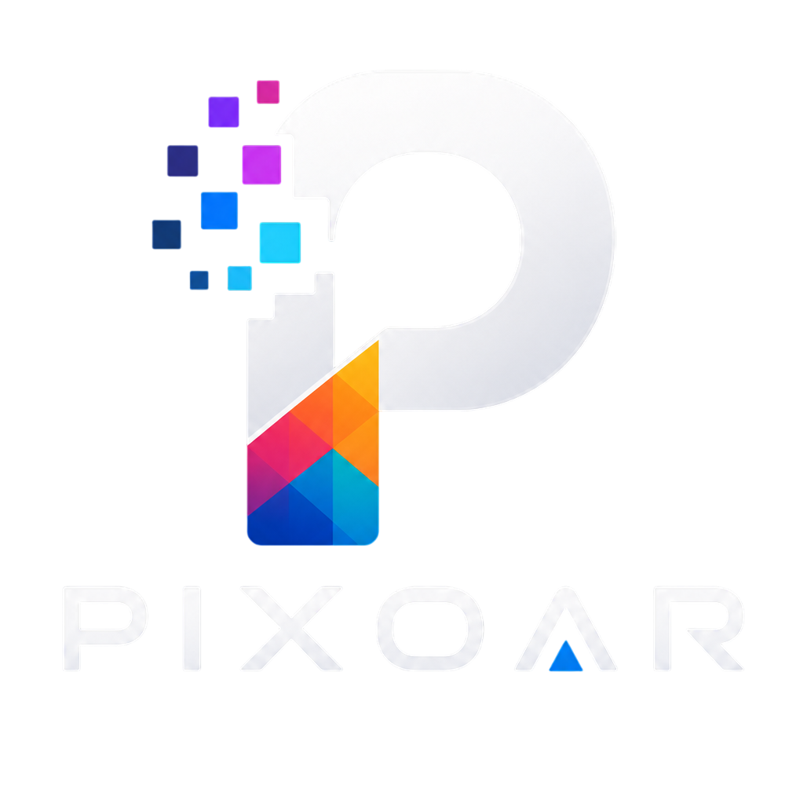
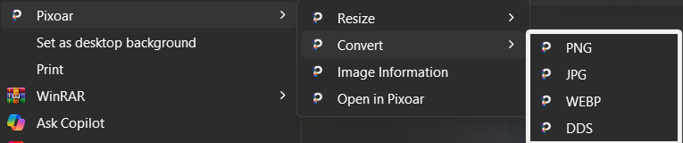

# Pixoar

<p align="center">
  
</p>

<p align="center">
  A lightweight native Windows utility for fast image conversion and resizing, with DDS support and Windows Explorer integration.
</p>

<p align="center">
  
  
  
  
</p>

---

> Built to make image conversion as fast as possible without opening an editor.

## Screenshots

<p align="center">
  
</p>

---

## Features

- Fast image conversion
- Batch conversion
- Percentage and dimension based resizing
- DDS conversion and preview
- Right click menu integration
- Image information viewer
- Drag and drop support

---

## Supported Formats

| Format | Read | Convert | Preview |
| ------ | :--: | :-----: | :-----: |
| PNG | ✅ | ✅ | ✅ |
| JPG / JPEG | ✅ | ✅ | ✅ |
| WEBP | ✅ | ✅ | ✅ |
| BMP | ✅ | ✅ | ✅ |
| TIFF | ✅ | ✅ | ✅ |
| DDS | ✅ | ✅ | ✅ |

---

## Download

Download the latest release from the **[Releases](https://github.com/Osama-AxJ/Pixoar/releases)** page.

The default release is framework dependent and requires the **.NET 8 Desktop Runtime (x64)**.

No installation is required.

Extract the .zip and run:

```text
Pixoar.exe
```

DDS support works out of the box using the bundled `texconv.exe`.

---

## Windows Explorer Integration

Pixoar can add quick actions directly to the Windows right-click menu.

To enable it:

1. Open **Settings**.
2. Go to **Quick Actions**.
3. Enable **Context Menu**.
4. Select the actions you want to appear in the context menu.
5. Click **Apply Changes**.

Available actions:

- Resize
- Convert
- View image information
- Open in Pixoar